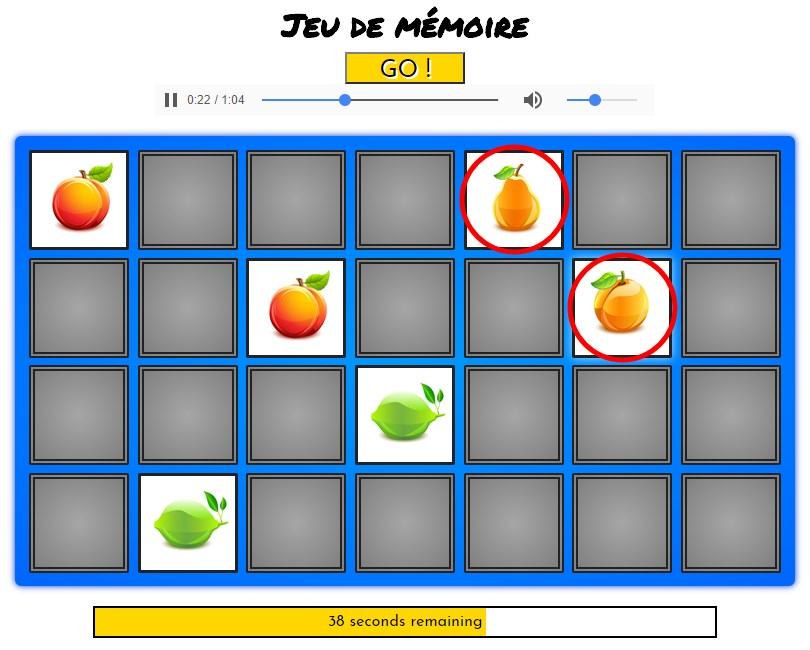

# Portfolio - Memory
[> Page détaillé de l'exercice sur mon site <](neo-explorer.com/portfolio/memory "Page de l'exercice sur mon site")

Reproduction du jeu du Memory de Ravensburger en JavaScript et à l'aide des librairies jQuery et jQueryUI.

## Principe
Parmi plusieurs cartes placées face cachées, en sélectionner deux. Si elles sont identiques, la paire est validée, sinon ces deux cartes sont replacées face cachée. Réitérer cette étape autant de fois que nécessaire afin de retrouver toutes les paires dans la limite de temps impartie (ici 60 secondes).

